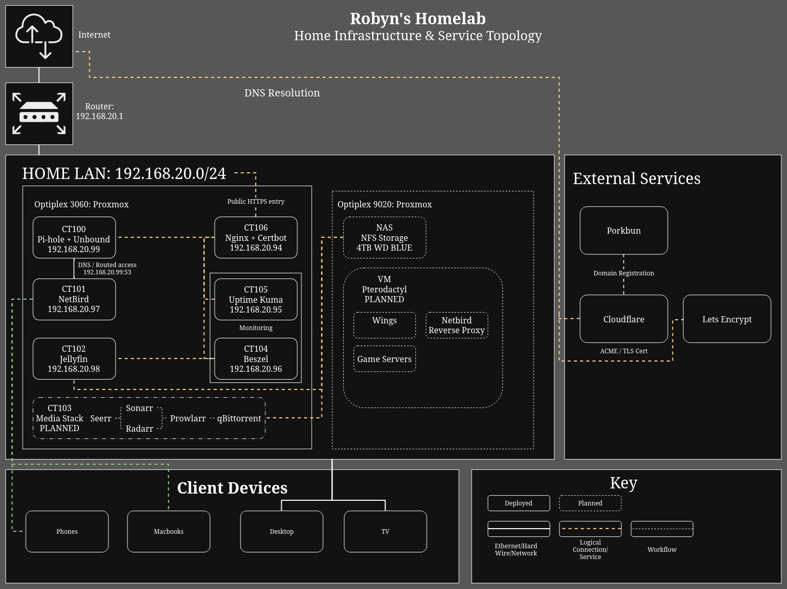

# Robyn's Homelab

A personal homelab built around **Linux, networking, virtualisation, self-hosting, and learning**.

The goal of this project is to build and document a practical home infrastructure environment from the ground up, while keeping the configuration and architecture easy to understand and reproduce.

## Project Status

🟢 **Core infrastructure deployed**

🟡 **9020 / NAS infrastructure in progress**

🔵 **Media stack and Pterodactyl planned**

## Architecture

The diagram shows the current infrastructure and planned near-term additions.

## Services

The homelab currently provides:

| Service         | Purpose                     |
| --------------- | --------------------------- |
| **Pi-hole**     | DNS filtering and local DNS |
| **Unbound**     | Recursive DNS resolution    |
| **Nginx**       | Reverse proxy and HTTPS     |
| **Certbot**     | TLS certificate management  |
| **NetBird**     | Private remote access       |
| **Jellyfin**    | Media streaming             |
| **Beszel**      | System monitoring           |
| **Uptime Kuma** | Service monitoring          |

Additional services are planned as the infrastructure develops.

## Documentation

The `docs/` directory contains detailed documentation covering the hardware, network architecture, Proxmox configuration, individual services, and supporting infrastructure.

Start with the [documentation overview](docs/00-overview.md).

The editable [network diagram](diagrams/network.drawio) is also included alongside the exported PNG.

This repository is primarily a **technical record and learning project** rather than a ready-to-deploy homelab configuration. The documentation reflects the actual environment and is updated as the infrastructure evolves.

---

> Built for learning, experimentation, and eventually having somewhere to host all the things.
